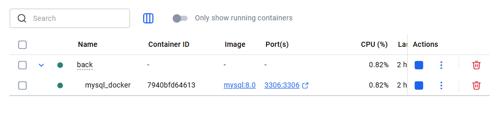
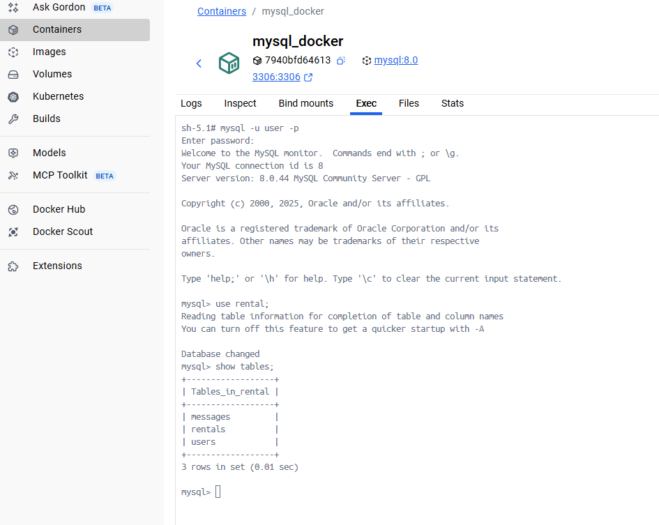

# Rental-backend

Backend qui gère les APIs des utilisateurs, des logements et les messages envoyés.

## Configuration du backend

    - name: Rental
    - port: 3001

## Pré-requis pour le bon fonctionnement du service :

    -> JDK 17
    -> Docker
    -> Docker Compose
    -> Maven 3.9.11 (https://archive.apache.org/dist/maven/maven-3/3.9.11/binaries/) ou plus

## Instancier la BDD
Pour Instancier la BDD (MySql), il faut :
- avoir démarré Docker-Desktop sur votre poste de travail local.
- dans une console, se placer dans le dossier « /Back » du projet et exécuter la commande Docker suivante :
```
docker compose up -d
```
Sur Docker-Desktop, vous devriez voir apparaître un container MySQL qui correspond au projet.



Vous pouvez vous connecter à la base de données et vérifier que les tables `messages`, `rentals` et `users` ont été créées automatiquement.
Pour cela, cliquez sur le lien `mysql-docker` ce qui vous amènera sur la vue complète de la base de données.
Dans l'onglet ```Exec```, il faut :

1. se connecter à la base de données. Tapez la commande ci-dessous

    ```
    mysql -u user -p
    ```
   L'invite de commande demandera le mot de passe, c'est-à-dire `Opc2025$`.


2. Se connecter au schéma de base de données `rental`. Dans l'invite de commande, tapez la commande ci-dessous :

    ```
    use rental;
    ```

3. Vérifier que les tables `messages`, `rentals` et `users` existent (elles sont néanmoins vide pour le moment).

    ```
    show tables;
    ```
   Le résultat devrait être :
    ```
    +------------------+
    | Tables_in_rental |
    +------------------+
    | messages         |
    | rentals          |
    | users            |
    +------------------+
    3 rows in set (0.01 sec)
   ```

La capture d'écran ci-dessous résume les étapes précédentes :



## Démarrage du backend
Pour démarrer le projet backend, il faut :
- avoir démarré Docker-Desktop sur votre poste de travail local.
- dans une console, se placer à la racine du projet et exécuter la commande Maven suivante :
```
mvn spring-boot:run
```

Cette commande va :
- lancer le serveur du backend et le connecter à la base de données précédemment créée

Les traces logs devraient ressemblées à ceci :
```
  .   ____          _            __ _ _
 /\\ / ___'_ __ _ _(_)_ __  __ _ \ \ \ \
( ( )\___ | '_ | '_| | '_ \/ _` | \ \ \ \
 \\/  ___)| |_)| | | | | || (_| |  ) ) ) )
  '  |____| .__|_| |_|_| |_\__, | / / / /
 =========|_|==============|___/=/_/_/_/

 :: Spring Boot ::                (v3.5.6)

[Rental] [           main] com.rental.RentalApplication             : Starting RentalApplication using Java 17.0.16 with PID 16420 (C:\Users\bandi\Documents\Formation_OCR\Projet_3\Developpez-le-back-end-en-utilisant-Java-et-Spring\P3-Full-Stack-portail-locataire\Back\target\classes started by bandi in C:\Users\bandi\Documents\Formation_OCR\Projet_3\Developpez-le-back-end-en-utilisant-Java-et-Spring\P3-Full-Stack-portail-locataire\Back)
[Rental] [           main] com.rental.RentalApplication             : No active profile set, falling back to 1 default profile: "default"
[Rental] [           main] .s.d.r.c.RepositoryConfigurationDelegate : Bootstrapping Spring Data JPA repositories in DEFAULT mode.
[Rental] [           main] .s.d.r.c.RepositoryConfigurationDelegate : Finished Spring Data repository scanning in 75 ms. Found 3 JPA repository interfaces.
[Rental] [           main] o.s.b.w.embedded.tomcat.TomcatWebServer  : Tomcat initialized with port 3001 (http)
[Rental] [           main] o.apache.catalina.core.StandardService   : Starting service [Tomcat]
[Rental] [           main] o.apache.catalina.core.StandardEngine    : Starting Servlet engine: [Apache Tomcat/10.1.46]
[Rental] [           main] o.a.c.c.C.[Tomcat].[localhost].[/]       : Initializing Spring embedded WebApplicationContext
[Rental] [           main] w.s.c.ServletWebServerApplicationContext : Root WebApplicationContext: initialization completed in 2131 ms
[Rental] [           main] com.zaxxer.hikari.HikariDataSource       : ${DB_NAME} - Starting...
[Rental] [           main] com.zaxxer.hikari.pool.HikariPool        : ${DB_NAME} - Added connection com.mysql.cj.jdbc.ConnectionImpl@7ac48f05
[Rental] [           main] com.zaxxer.hikari.HikariDataSource       : ${DB_NAME} - Start completed.
[Rental] [           main] o.hibernate.jpa.internal.util.LogHelper  : HHH000204: Processing PersistenceUnitInfo [name: default]
[Rental] [           main] org.hibernate.Version                    : HHH000412: Hibernate ORM core version 6.6.29.Final
[Rental] [           main] o.h.c.internal.RegionFactoryInitiator    : HHH000026: Second-level cache disabled
[Rental] [           main] o.s.o.j.p.SpringPersistenceUnitInfo      : No LoadTimeWeaver setup: ignoring JPA class transformer
[Rental] [           main] org.hibernate.orm.connections.pooling    : HHH10001005: Database info:
	Database JDBC URL [Connecting through datasource 'HikariDataSource (${DB_NAME})']
	Database driver: undefined/unknown
	Database version: 8.0.44
	Autocommit mode: undefined/unknown
	Isolation level: undefined/unknown
	Minimum pool size: undefined/unknown
	Maximum pool size: undefined/unknown
[Rental] [           main] o.h.e.t.j.p.i.JtaPlatformInitiator       : HHH000489: No JTA platform available (set 'hibernate.transaction.jta.platform' to enable JTA platform integration)
[Rental] [           main] j.LocalContainerEntityManagerFactoryBean : Initialized JPA EntityManagerFactory for persistence unit 'default'
[Rental] [           main] JpaBaseConfiguration$JpaWebConfiguration : spring.jpa.open-in-view is enabled by default. Therefore, database queries may be performed during view rendering. Explicitly configure spring.jpa.open-in-view to disable this warning
[Rental] [           main] o.s.b.w.embedded.tomcat.TomcatWebServer  : Tomcat started on port 3001 (http) with context path '/'
[Rental] [           main] com.rental.RentalApplication             : Started RentalApplication in 7.122 seconds (process running for 7.725)

```
Le Backend est lancé.